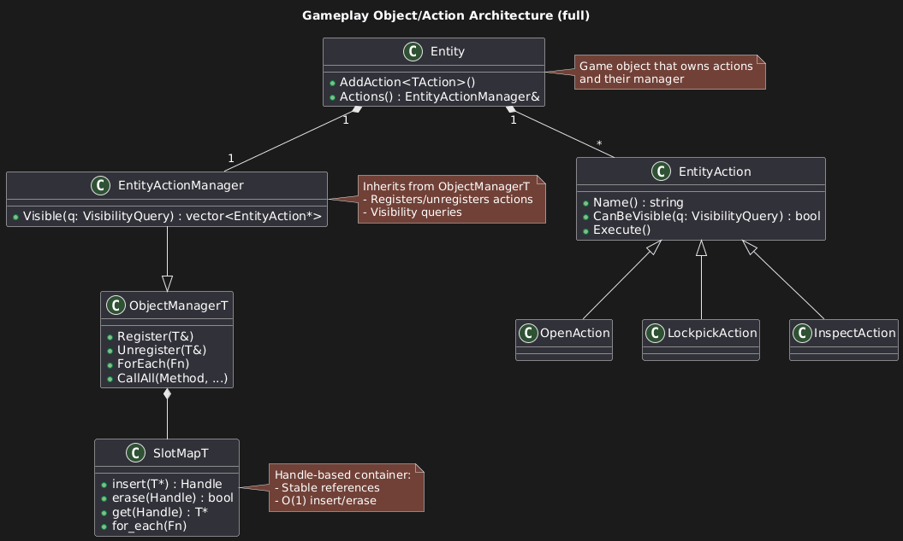

# 🎮 Gameplay Action System (Demo)

A compact, testable gameplay action architecture in C++ built around a generic object manager and a slot-based container.  
Entities **own** actions; managers **register/filter** them; a custom **SlotMap** gives stable handles with O(1) insert/erase.

---

## 📊 UML Diagram



---

## 🧩 Components

- **Entity** — game object; owns `EntityActionManager` & the actions’ lifetime.
- **EntityAction (abstract)** — interface for gameplay actions:
  - `Name()` • `CanBeVisible(query)` • `Execute()`.
- **EntityActionManager** — non-owning registry for actions:
  - RAII `Register/Unregister` from action ctors/dtors,
  - `Visible(query)` returns the filtered list,
  - iteration & broadcast via `ForEach/CallAll`.
- **ObjectManager<T>** — generic registry that backs concrete managers.
- **SlotMap<T>** — handle-based storage (stable handles; O(1) insert/erase).
- **Example actions** — `OpenAction`, `LockpickAction`, `InspectAction`.

---

## 🧪 Tests

Unit tests (GoogleTest) cover:
- Action lifecycle (register/unregister via RAII),
- Visibility filtering,
- SlotMap handle validity & reuse.

Run from **Visual Studio Test Explorer** or:

```bash
ctest --output-on-failure
```

---

## 📂 Layout

```plaintext
Bohemia_Demo/
 ├─ include/Core/         # Entity, EntityAction, Manager, SlotMap, ...
 ├─ include/Actions/      # OpenAction, LockpickAction, InspectAction
 ├─ src/                  # Sources
 └─ Bohemia_Demo.cpp      # Console demo

Bohemia_Tests/            # GoogleTest project
```

---

## ⚙️ Build

```bash
git clone https://github.com/SpaceOak/Demos.git
```

1. Open **Bohemia_Demo.sln** in Visual Studio (x64 / Debug).  
2. Build **Bohemia_Demo** and **Bohemia_Tests**.  
3. Run the console demo or execute the tests.  

---

## 📌 Notes & Trade-offs

- Managers store **non-owning pointers**; ownership stays in `Entity`.
- **Not thread-safe** (kept minimal and cache-friendly).
- **Destruction order** is intentional: actions (owned) are destroyed before their manager.

---

## 📝 License

MIT — free to use and extend.
